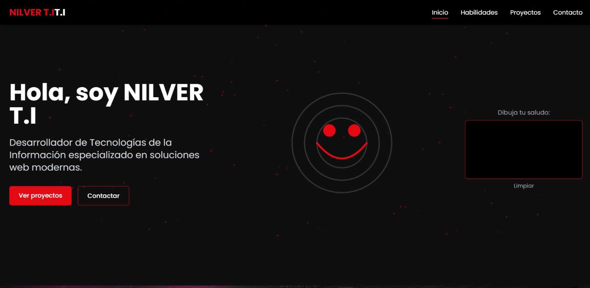

# NILVER T.I - Portfolio

Sitio web tipo portfolio personal, desarrollado con enfoque moderno y visual limpio para presentar habilidades, proyectos y canales de contacto.

## Vista

[Ver vista principal](./index.html)



## Tecnologias

- HTML5
- CSS3
- JavaScript (Vanilla)
- Tailwind CSS (CDN)
- Font Awesome

## Secciones principales

- Inicio (`#home`)
- Habilidades (`#skills`)
- Proyectos (`#projects`)
- Contacto (`#contact`)

## Estructura del proyecto

```text
Practica 2/
|-- index.html
|-- README.md
|-- css/
|   `-- estilos.css
|-- js/
|   |-- fondo.js
|   `-- main.js
`-- img/
    |-- home.jpeg
    |-- redes.jpg
    |-- flores.jpg
    |-- arbol.jpg
    |-- corazon.jpg
    `-- cicsa.jpg
```

## Como ejecutar

1. Abre la carpeta del proyecto.
2. Ejecuta `index.html` en el navegador (o usa Live Server en VS Code).

## Autor

- Nombre: NILVER T.I
- GitHub: <https://github.com/NilverTI>
- LinkedIn: <https://www.linkedin.com/in/nilverti/>
