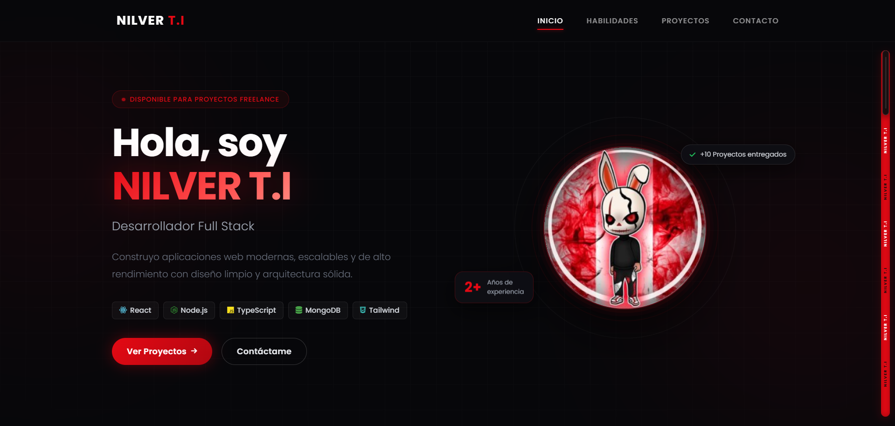

# NILVER T.I - Portfolio

Sitio web portfolio personal refactorizado con una arquitectura modular, limpia y escalable, manteniendo el mismo diseño visual, las mismas animaciones y la misma funcionalidad observable del sitio original.

[](https://nilverti.de/)

## Vista previa

[](https://nilverti.de/)

## Tecnologias

- HTML5
- CSS3
- JavaScript (Vanilla + ES Modules)
- Tailwind CSS (CDN)
- Font Awesome
- Node.js para generar artefactos del sitio

## Estructura final

```text
PortafolioNilver/
|-- index.html
|-- README.md
|-- config/
|   `-- site.config.json
|-- html/
|   |-- template.html
|   |-- header.html
|   |-- home.html
|   |-- skills.html
|   |-- projects.html
|   |-- contact.html
|   `-- footer.html
|-- css/
|   |-- base.css
|   |-- header.css
|   |-- home.css
|   |-- skills.css
|   |-- projects.css
|   |-- contact.css
|   `-- footer.css
|-- js/
|   |-- main.js
|   |-- header.js
|   |-- home.js
|   |-- skills.js
|   |-- projects.js
|   |-- contact.js
|   |-- footer.js
|   |-- constants/
|   |   `-- site-data.js
|   |-- generated/
|   |   |-- site-config.js
|   |   `-- section-templates.js
|   |-- modules/
|   |   |-- drawing-canvas.js
|   |   |-- navigation.js
|   |   |-- particles-background.js
|   |   |-- profile-svg.js
|   |   |-- project-details.js
|   |   |-- projects-list.js
|   |   |-- skills-view.js
|   |   `-- social-links.js
|   |-- services/
|   |   `-- section-loader.js
|   `-- utils/
|       `-- dom.js
|-- scripts/
|   `-- build.js
`-- img/
    |-- ico/
    |   `-- home.jpeg
    `-- proyectos/
        |-- arbol.jpg
        |-- cicsa.jpg
        |-- corazon.jpg
        |-- flores.jpg
        |-- movilbuspsv.webp
        |-- peruserver.webp
        |-- rarazpsv.webp
        |-- redes.jpg
        `-- transzelapsv.webp
```

## Como queda conectado

- `config/site.config.json` define el shell del sitio, el orden de las secciones y los estilos globales.
- `scripts/build.js` genera:
  - `index.html`
  - `js/generated/site-config.js`
  - `js/generated/section-templates.js`
- `index.html` queda como entry point limpio y solo carga estilos, slots de seccion y `js/main.js`.
- `js/main.js` monta las secciones, inicializa cada modulo y coordina el sitio.
- `js/services/section-loader.js` carga los parciales HTML y usa fallback generado cuando hace falta.
- `js/constants/site-data.js` concentra la data repetida de navegacion, habilidades, proyectos y redes sociales.
- `js/modules/` encapsula la logica de UI e interacciones.

## Flujo de trabajo

1. Edita las secciones en `html/`.
2. Edita estilos en `css/`.
3. Edita logica o datos en `js/`.
4. Ejecuta `node scripts/build.js`.
5. Abre `index.html` en el navegador o con Live Server.

## Autor

- Nombre: NILVER T.I
- GitHub: <https://github.com/NilverTI>
- LinkedIn: <https://www.linkedin.com/in/nilverti/>
